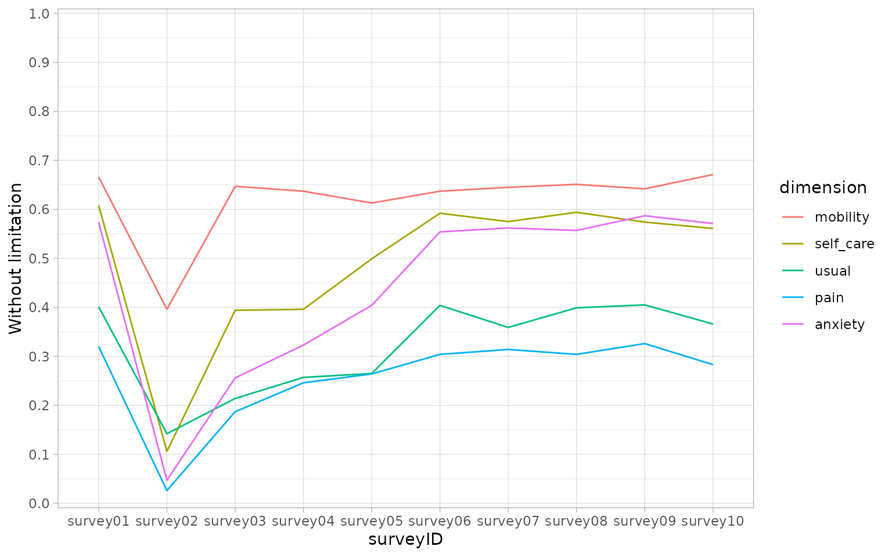
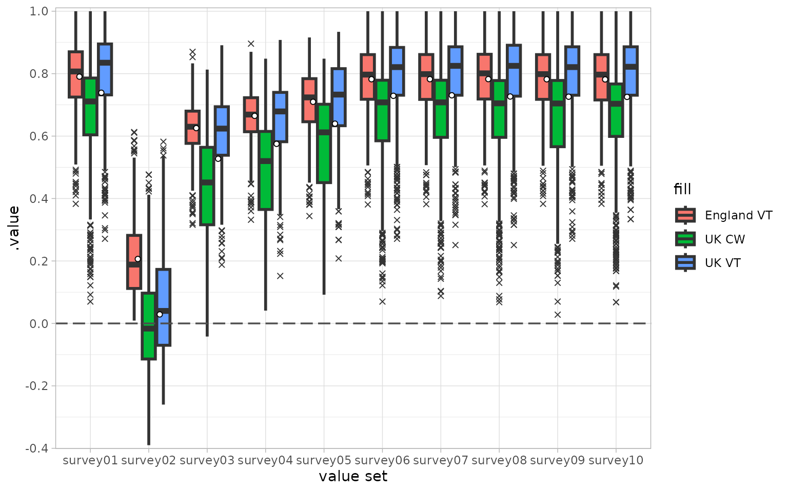

# qalytools

qalytools provides a simple and intuitive user interface for the
analysis of [EQ-5D](https://euroqol.org/eq-5d-instruments) surveys. It
builds upon the [eq5d](https://cran.r-project.org/package=eq5d) package
to facilitate the calculation of QALY metrics and other related values
across multiple surveys.

## Overview

The package provides a range of functions:

- Coercion functions
  [`as_eq5d3l()`](https://timtaylor.github.io/qalytools/reference/as_eq5d.md),
  [`as_eq5d5l()`](https://timtaylor.github.io/qalytools/reference/as_eq5d.md)
  and
  [`as_eq5dy3l()`](https://timtaylor.github.io/qalytools/reference/as_eq5d.md)
  for converting existing objects to EQ5D data frame subclasses (EQ5D3L,
  EQ5D5L and EQ5DY3L).

- The calculation of utility values based on a range of different value
  sets. This functionality is provided via the
  [`calculate_utility()`](https://timtaylor.github.io/qalytools/reference/calculate_utility.md),
  [`add_utility()`](https://timtaylor.github.io/qalytools/reference/calculate_utility.md)
  and
  [`available_valuesets()`](https://timtaylor.github.io/qalytools/reference/available_valuesets.md)
  functions which are wrappers around the functionality of the
  underlying eq5d package.

- The calculation of different Quality of Life Years (QALY) metrics
  including unadjusted ‘raw’ values, and the disutility from both
  perfect health and, optionally, a specified baseline. See
  [`calculate_qalys()`](https://timtaylor.github.io/qalytools/reference/calculate_qalys.md).

- The calculation of the Paretian Classification of Health Change (PCHC)
  in an individual’s health state between two surveys via
  [`calculate_pchc()`](https://timtaylor.github.io/qalytools/reference/calculate_pchc.md)
  (again wrapping functionality of the eq5d package).

- Easy calculation of responses with a health limitation (i.e. a non-one
  response in one of the dimensions) via
  [`calculate_limitation()`](https://timtaylor.github.io/qalytools/reference/calculate_limitation.md).

Whilst this vignette provides an introduction to the core functionality
of the package, an example analysis can be found in the [EQ5D
Analysis](https://timtaylor.github.io/qalytools/articles/example_analysis.html)
article on the package website.

## The EQ5D object class

We define an `EQ5D` object as a table with data represented in long
format that meets a few additional criteria:

- It contains columns that represent dimensions from the EQ5D survey
  specification as well as a column representing the Visual Analogue
  Score (columns ‘mobility’, ‘self_care’, ‘usual’, ‘pain’, ‘anxiety’ and
  ‘vas’ in the example table below)

- Dimension values must be whole numbers, bounded between 1 and 3 for
  EQ5D3L and EQ5D3Y surveys or bounded between 1 and 5 for EQ5D5L
  surveys.

- It contains a column that acts as a unique respondent identifier
  (`respondentID`) and another that identifying different surveys over
  time (\`surveyID). Together these should uniquely identify a response
  (i.e. no combination of these should be duplicated within the given
  data frame).

| surveyID | respondentID | time_index | mobility | self_care | usual | pain | anxiety | vas | sex | age |
|---:|---:|---:|---:|---:|---:|---:|---:|---:|:---|---:|
| . | . | . | . | . | . | . | . | . | . | . |
| 1 | 1 | 30 | 3 | 2 | 2 | 1 | 1 | 87 | Female | 25 |
| 1 | 2 | 30 | 2 | 2 | 2 | 2 | 2 | 65 | Male | 30 |
| 1 | 3 | 30 | 1 | 3 | 3 | 1 | 3 | 76 | Male | 39 |
| 1 | 4 | 30 | 1 | 2 | 3 | 2 | 4 | 55 | Female | 60 |
| 1 | 5 | 30 | 2 | 1 | 4 | 1 | 1 | 80 | Male | 28 |
| 1 | 6 | 30 | 1 | 3 | 2 | 1 | 1 | 83 | Male | 59 |
| . | . | . | . | . | . | . | . | . | . | . |

Example of an EQ5D5L object {.table style="width:100%;"}

In qalytools these `EQ5D` objects are implemented as a subclass of data
frame and we provide associated methods for working with this class.

## Usage

In the following examples we make use of a synthetic EQ-5D-5L data set
that is included in the package

``` r

library(qalytools)
library(ggplot2)

# Example EQ5D5L data
data("EQ5D5L_surveys")
str(EQ5D5L_surveys)
#> tibble [10,000 × 12] (S3: tbl_df/tbl/data.frame)
#>  $ surveyID    : chr [1:10000] "survey01" "survey02" "survey03" "survey04" ...
#>  $ respondentID: int [1:10000] 1 1 1 1 1 1 1 1 1 1 ...
#>  $ sex         : chr [1:10000] "Female" "Female" "Female" "Female" ...
#>  $ age         : int [1:10000] 25 25 25 25 25 25 25 25 25 25 ...
#>  $ mobility    : int [1:10000] 2 1 1 1 1 2 2 1 1 2 ...
#>  $ self_care   : int [1:10000] 1 4 5 2 2 1 1 1 3 1 ...
#>  $ usual       : int [1:10000] 2 5 2 5 3 1 2 2 2 2 ...
#>  $ pain        : int [1:10000] 1 5 1 2 3 2 1 2 1 1 ...
#>  $ anxiety     : int [1:10000] 1 3 3 2 1 1 1 1 1 1 ...
#>  $ time_index  : num [1:10000] 30 60 90 120 150 180 210 240 270 300 ...
#>  $ vas         : num [1:10000] 96 23 70 68 87 95 96 96 94 96 ...
#>  $ dummy       : logi [1:10000] TRUE FALSE TRUE FALSE TRUE FALSE ...
```

### Coercion

Before utilising methods from qalytools we must first coerce our input
data to the `<EQ5D5L>` object class via
[`as_eq5d5l()`](https://timtaylor.github.io/qalytools/reference/as_eq5d.md)

``` r

(dat <- as_eq5d5l(
    EQ5D5L_surveys,
    mobility = "mobility",
    self_care = "self_care",
    usual = "usual",
    pain = "pain",
    anxiety = "anxiety",
    respondentID = "respondentID",
    surveyID = "surveyID",
    vas = "vas"
))
#> # EQ-5D-5L: 10,000 x 12
#>    surveyID respondentID sex      age mobility self_care usual  pain anxiety
#>    <chr>           <int> <chr>  <int>    <int>     <int> <int> <int>   <int>
#>  1 survey01            1 Female    25        2         1     2     1       1
#>  2 survey02            1 Female    25        1         4     5     5       3
#>  3 survey03            1 Female    25        1         5     2     1       3
#>  4 survey04            1 Female    25        1         2     5     2       2
#>  5 survey05            1 Female    25        1         2     3     3       1
#>  6 survey06            1 Female    25        2         1     1     2       1
#>  7 survey07            1 Female    25        2         1     2     1       1
#>  8 survey08            1 Female    25        1         1     2     2       1
#>  9 survey09            1 Female    25        1         3     2     1       1
#> 10 survey10            1 Female    25        2         1     2     1       1
#> # ℹ 9,990 more rows
#> # ℹ 3 more variables: time_index <dbl>, vas <dbl>, dummy <lgl>
```

### Descriptive methods

To obtain a quick overview of the data we can call
[`summary()`](https://rdrr.io/r/base/summary.html). By default this
returns the output as a list of data frames, showing frequency counts
and proportions, split by `surveyID`

``` r

head(summary(dat), n = 2)
#> $survey01
#> # A tibble: 6 × 6
#>   value mobility self_care usual  pain anxiety
#>   <dbl>    <dbl>     <dbl> <dbl> <dbl>   <dbl>
#> 1     1      666       608   401   320     574
#> 2     2      196       131   303   359     235
#> 3     3      114       205   166   287     150
#> 4     4       19        18    61    24      29
#> 5     5        5        38    69    10      12
#> 6    NA        0         0     0     0       0
#> 
#> $survey02
#> # A tibble: 6 × 6
#>   value mobility self_care usual  pain anxiety
#>   <dbl>    <dbl>     <dbl> <dbl> <dbl>   <dbl>
#> 1     1      396       106   142    26      47
#> 2     2      248       169   177    71      92
#> 3     3      194       214   160    93     103
#> 4     4       83       277   237   364     381
#> 5     5       79       234   284   446     377
#> 6    NA        0         0     0     0       0
```

Alternatively we can set the parameter `tidy` to TRUE and obtain the
summary data in a “tidy” (long) format.

``` r

summary(dat, tidy = TRUE)
#> # A tibble: 300 × 4
#>    surveyID dimension value count
#>    <chr>    <fct>     <dbl> <dbl>
#>  1 survey01 mobility      1   666
#>  2 survey01 mobility      2   196
#>  3 survey01 mobility      3   114
#>  4 survey01 mobility      4    19
#>  5 survey01 mobility      5     5
#>  6 survey01 mobility     NA     0
#>  7 survey01 self_care     1   608
#>  8 survey01 self_care     2   131
#>  9 survey01 self_care     3   205
#> 10 survey01 self_care     4    18
#> # ℹ 290 more rows
```

It can be useful to look at the percentage of responses, across
dimensions, that are not equal to one. This can be done with the
[`calculate_limitation()`](https://timtaylor.github.io/qalytools/reference/calculate_limitation.md)
function

``` r

(limitation <- calculate_limitation(dat))
#> # A tibble: 50 × 3
#>    surveyID dimension without_limitation
#>    <chr>    <fct>                  <dbl>
#>  1 survey01 mobility               0.666
#>  2 survey02 mobility               0.396
#>  3 survey03 mobility               0.647
#>  4 survey04 mobility               0.637
#>  5 survey05 mobility               0.613
#>  6 survey06 mobility               0.637
#>  7 survey07 mobility               0.645
#>  8 survey08 mobility               0.651
#>  9 survey09 mobility               0.642
#> 10 survey10 mobility               0.671
#> # ℹ 40 more rows

ggplot(limitation, aes(x = surveyID, y = without_limitation, group = dimension)) +
    geom_line(aes(colour = dimension)) +
    theme_light() +
    scale_y_continuous(n.breaks = 10, expand = c(0.005, 0.005), limits = c(0, 1)) +
    scale_x_discrete() +
    scale_fill_discrete(name = "dimension") +
    ylab("Without limitation")
```



### Calculating utility values

To calculate the utility values we call
[`calculate_utility()`](https://timtaylor.github.io/qalytools/reference/calculate_utility.md)
on our EQ5D object with additional arguments specifying the countries
and type we are interested in.
[`calculate_utility()`](https://timtaylor.github.io/qalytools/reference/calculate_utility.md)
will return the desired values split by country, type, respondentID and
surveyID. If you prefer to augment the utility values on top of the
input object we also provide the
[`add_utility()`](https://timtaylor.github.io/qalytools/reference/calculate_utility.md)
function.

We can obtain a list of compatible value sets (across countries and
type) by passing our EQ5D object directly to the
[`available_valuesets()`](https://timtaylor.github.io/qalytools/reference/available_valuesets.md)
function or by passing a comparable string.

For EQ5D3L inputs the type can be:

- TTO, the time trade-off valuation technique;

- VAS, the visual analogue scale valuation technique;

- RCW, a reverse crosswalk conversion to EQ5D5L values; or

- DSU, the NICE Decision Support Unit’s model that allows mappings on to
  EQ5D5L values accounting for both age and sex.

For EQ5D5L inputs this can be:

- VT, value sets generated via a EuroQol standardised valuation study
  protocol;

- CW, a crosswalk conversion EQ5D3L values; or

- DSU, the NICE Decision Support Unit’s model that allows mappings on to
  EQ5D5L values accounting for both age and sex.

Note that
[`available_valuesets()`](https://timtaylor.github.io/qalytools/reference/available_valuesets.md)is
a convenience wrapper around the
[`eq5d::valuesets()`](https://rdrr.io/pkg/eq5d/man/valuesets.html)
function. It will return a A \[`tibble`\]\[tibble::tibble\] with columns
representing the EQ5D version, the value set country and the valueset
type.

``` r

vs <- available_valuesets(dat)
head(vs, 10)
#> # A tibble: 10 × 7
#>    Version  Type  Country       PubMed DOI                     ISBN  ExternalURL
#>    <chr>    <chr> <chr>          <int> <chr>                   <chr> <chr>      
#>  1 EQ-5D-5L CW    Bermuda     38982011 10.1007/s10198-024-017… NA    NA         
#>  2 EQ-5D-5L CW    Denmark     22867780 10.1016/j.jval.2012.02… NA    NA         
#>  3 EQ-5D-5L CW    France      22867780 10.1016/j.jval.2012.02… NA    NA         
#>  4 EQ-5D-5L CW    Germany     22867780 10.1016/j.jval.2012.02… NA    NA         
#>  5 EQ-5D-5L CW    Japan       22867780 10.1016/j.jval.2012.02… NA    NA         
#>  6 EQ-5D-5L CW    Jordan      39225720 10.1007/s10198-024-017… NA    NA         
#>  7 EQ-5D-5L CW    Netherlands 22867780 10.1016/j.jval.2012.02… NA    NA         
#>  8 EQ-5D-5L CW    Russia      33713323 10.1007/s11136-021-028… NA    NA         
#>  9 EQ-5D-5L CW    Spain       22867780 10.1016/j.jval.2012.02… NA    NA         
#> 10 EQ-5D-5L CW    Thailand    22867780 10.1016/j.jval.2012.02… NA    NA

# comparable character values will also give the same result
identical(vs, available_valuesets("eq5d5l"))
#> [1] TRUE

# cross walk comparison
vs <- subset(vs, Country %in% c("England", "UK") & Type %in% c("VT", "CW"))
util <- calculate_utility(dat, type = vs$Type, country = vs$Country)

# plot the results
util$fill <- paste(util$.utility_country, util$.utility_type)
ggplot(util, aes(x = surveyID, y = .value, fill = fill)) +
    geom_boxplot(lwd = 1, outlier.shape = 4) +
    stat_summary(
        mapping = aes(group = .utility_country),
        fun = mean,
        geom = "point",
        position = position_dodge(width = 0.75),
        shape = 21,
        color = "black",
        fill = "white"
    ) +
    theme_light() +
    geom_hline(yintercept = 0, linetype = "longdash", size = 0.6, color = "grey30") +
    scale_y_continuous(n.breaks = 10, expand = c(0.005, 0.005)) +
    scale_x_discrete(name = "value set")
#> Warning: Using `size` aesthetic for lines was deprecated in ggplot2 3.4.0.
#> ℹ Please use `linewidth` instead.
#> This warning is displayed once per session.
#> Call `lifecycle::last_lifecycle_warnings()` to see where this warning was
#> generated.
```



For further details about the available value sets, consult the
documentation of the wrapped eq5d package via
[`vignette(topic = "eq5d", package = "eq5d")`](https://cran.rstudio.com/web/packages/eq5d/vignettes/eq5d.html).

### QALY calculations

Quality of life years can be calculated directly from utility values. By
default, two different metrics are provided. Firstly, a “raw” value
which is simply the scaled area under the utility curve and, secondly, a
value which represents the loss from full health.

``` r

qalys <-
    dat |>
    add_utility(type = "VT", country = c("Denmark", "France")) |>
    calculate_qalys(time_index = "time_index")

subset(qalys, .qaly == "raw")
#> # A tibble: 2,000 × 5
#>    respondentID .utility_type .utility_country .qaly .value
#>           <int> <chr>         <chr>            <chr>  <dbl>
#>  1            1 VT            Denmark          raw    0.544
#>  2            1 VT            France           raw    0.573
#>  3            2 VT            Denmark          raw    0.487
#>  4            2 VT            France           raw    0.503
#>  5            3 VT            Denmark          raw    0.530
#>  6            3 VT            France           raw    0.577
#>  7            4 VT            Denmark          raw    0.276
#>  8            4 VT            France           raw    0.430
#>  9            5 VT            Denmark          raw    0.506
#> 10            5 VT            France           raw    0.575
#> # ℹ 1,990 more rows
subset(qalys, .qaly == "loss_vs_fullhealth")
#> # A tibble: 2,000 × 5
#>    respondentID .utility_type .utility_country .qaly              .value
#>           <int> <chr>         <chr>            <chr>               <dbl>
#>  1            1 VT            Denmark          loss_vs_fullhealth  0.195
#>  2            1 VT            France           loss_vs_fullhealth  0.166
#>  3            2 VT            Denmark          loss_vs_fullhealth  0.252
#>  4            2 VT            France           loss_vs_fullhealth  0.237
#>  5            3 VT            Denmark          loss_vs_fullhealth  0.210
#>  6            3 VT            France           loss_vs_fullhealth  0.162
#>  7            4 VT            Denmark          loss_vs_fullhealth  0.463
#>  8            4 VT            France           loss_vs_fullhealth  0.310
#>  9            5 VT            Denmark          loss_vs_fullhealth  0.233
#> 10            5 VT            France           loss_vs_fullhealth  0.164
#> # ℹ 1,990 more rows
```

[`calculate_qalys()`](https://timtaylor.github.io/qalytools/reference/calculate_qalys.md)
also allows us to calculate the loss from a specified baseline in one of
two ways. Firstly, a character string `baseline_survey` argument can be
placed which matches a survey present in the utility data. If the
argument is passed as such then the utility values from the specified
survey are used to calculate the loss. Note that the survey is still
included in the raw, unadjusted calculation, prior to the calculation of
loss.

``` r

# Reload the example data and combine with some baseline measurements
data("EQ5D5L_surveys")
dat <- as_eq5d5l(
    EQ5D5L_surveys,
    mobility = "mobility",
    self_care = "self_care",
    usual = "usual",
    pain = "pain",
    anxiety = "anxiety",
    respondentID = "respondentID",
    surveyID = "surveyID",
    vas = "vas"
)

add_utility(dat, type = "VT", country = c("Denmark", "France")) |>
    calculate_qalys(baseline_survey = "survey01", time_index = "time_index") |>
    subset(.qaly == "loss_vs_baseline")
#> # A tibble: 2,000 × 5
#>    respondentID .utility_country .utility_type .qaly              .value
#>           <int> <chr>            <chr>         <chr>               <dbl>
#>  1            1 Denmark          VT            loss_vs_baseline  0.141  
#>  2            1 France           VT            loss_vs_baseline  0.114  
#>  3            2 Denmark          VT            loss_vs_baseline  0.0892 
#>  4            2 France           VT            loss_vs_baseline -0.00370
#>  5            3 Denmark          VT            loss_vs_baseline  0.0965 
#>  6            3 France           VT            loss_vs_baseline  0.106  
#>  7            4 Denmark          VT            loss_vs_baseline  0.175  
#>  8            4 France           VT            loss_vs_baseline  0.0450 
#>  9            5 Denmark          VT            loss_vs_baseline  0.142  
#> 10            5 France           VT            loss_vs_baseline  0.0915 
#> # ℹ 1,990 more rows
```

Alternatively the `baseline_survey` argument can be specified as a data
frame with a column corresponding to the respondentID and another
representing the associated utility. Optionally columns corresponding to
the utility country and utility type can be included to allow more
granular comparisons. Note that for this specification of baseline, it
is **not** included in the unadjusted, raw, calculation.

``` r

split_dat <- split(dat, dat$surveyID == "survey01")
surveys <- split_dat[[1]]
baseline <- split_dat[[2]]
utility_dat <- add_utility(
    surveys,
    type = "VT",
    country = c("Denmark", "France")
)
baseline_utility <-
    baseline |>
    add_utility(type = "VT", country = c("Denmark", "France")) |>
    subset(select = c(respondentID, .utility_country, .utility_type, .value))

calculate_qalys(utility_dat, baseline_survey = baseline_utility, time_index = "time_index") |>
    subset(.qaly == "loss_vs_baseline")
#> # A tibble: 2,000 × 5
#>    respondentID .utility_country .utility_type .qaly             .value
#>           <int> <chr>            <chr>         <chr>              <dbl>
#>  1            1 Denmark          VT            loss_vs_baseline  0.101 
#>  2            1 France           VT            loss_vs_baseline  0.0796
#>  3            2 Denmark          VT            loss_vs_baseline  0.0556
#>  4            2 France           VT            loss_vs_baseline -0.0341
#>  5            3 Denmark          VT            loss_vs_baseline  0.0672
#>  6            3 France           VT            loss_vs_baseline  0.0788
#>  7            4 Denmark          VT            loss_vs_baseline  0.145 
#>  8            4 France           VT            loss_vs_baseline  0.0182
#>  9            5 Denmark          VT            loss_vs_baseline  0.0959
#> 10            5 France           VT            loss_vs_baseline  0.0553
#> # ℹ 1,990 more rows
```

### Other functionality

#### Paretian Classification of Health Change (PCHC)

``` r

data("eq5d3l_example")
dat <- as_eq5d3l(
    eq5d3l_example,
    respondentID = "respondentID",
    surveyID = "surveyID",
    mobility = "MO",
    self_care = "SC",
    usual = "UA",
    pain = "PD",
    anxiety = "AD",
    vas = "vas"
)
grp1 <- subset(dat, Group == "Group1")
grp2 <- subset(dat, Group == "Group2")
calculate_pchc(grp1, grp2)
#> # A tibble: 5 × 3
#>   Change       Number Percent
#>   <chr>         <dbl>   <dbl>
#> 1 No change        14      14
#> 2 Improve          59      59
#> 3 Worsen           14      14
#> 4 Mixed change     13      13
#> 5 No problems       0       0
calculate_pchc(grp1, grp2, by.dimension = TRUE)
#> # A tibble: 20 × 4
#>    .Dimension Change      Number Percent
#>    <chr>      <chr>        <dbl>   <dbl>
#>  1 MO         No change       31      31
#>  2 MO         Improve         26      26
#>  3 MO         Worsen           7       7
#>  4 MO         No problems     36      36
#>  5 SC         No change       21      21
#>  6 SC         Improve         31      31
#>  7 SC         Worsen           7       7
#>  8 SC         No problems     41      41
#>  9 UA         No change       33      33
#> 10 UA         Improve         43      43
#> 11 UA         Worsen           6       6
#> 12 UA         No problems     18      18
#> 13 PD         No change       59      59
#> 14 PD         Improve         34      34
#> 15 PD         Worsen           3       3
#> 16 PD         No problems      4       4
#> 17 AD         No change       14      14
#> 18 AD         Improve         22      22
#> 19 AD         Worsen          12      12
#> 20 AD         No problems     52      52
```
